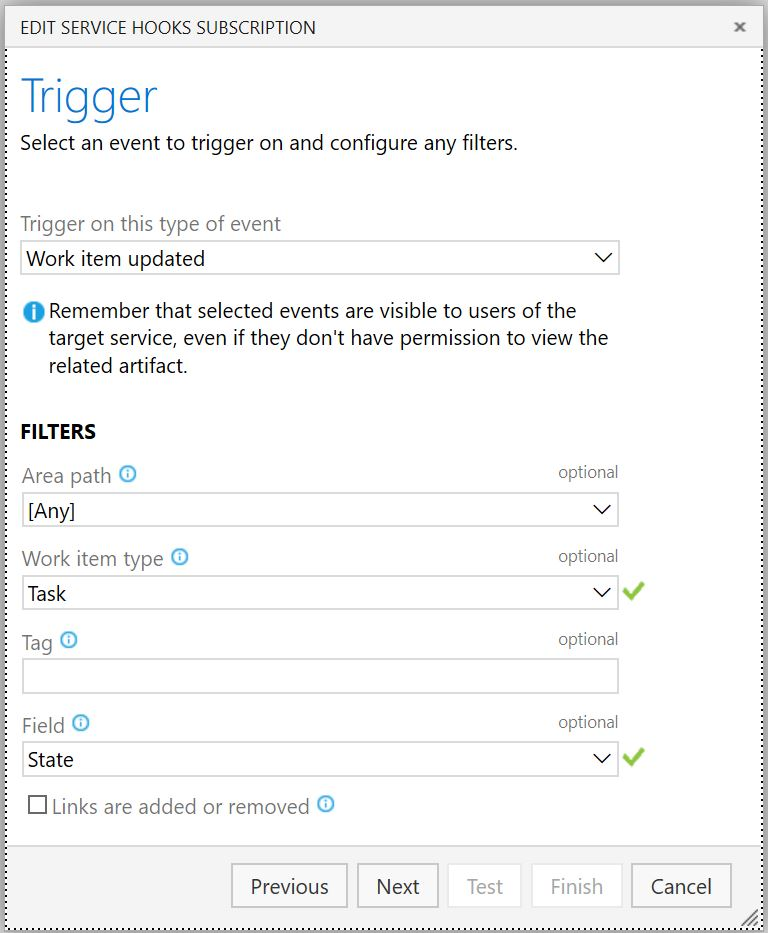
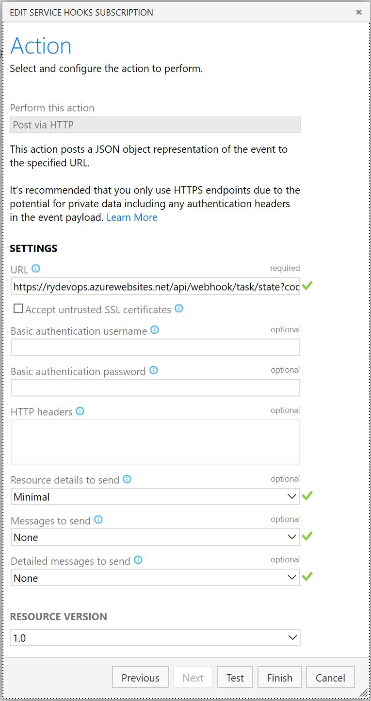

# AzureDevOpsUtilHooks

This repo contains very crude code for an Azure Function that will automatically mark an Azure DevOps user story as `Resolved` once all child tasks are marked as `Closed`.

**NOTE:** This code is ugly and doesn't handle exceptional cases (don't @ me, unless pull it's a pull request :-P).

## Setup

1. Clone this repo and publish to an Azure Function
2. Create 2 AppSettings for your Azure Function:
	- Name: `DevOpsOrgName`, Value: if your Azure DevOps url is: https://dev.azure.com/foobarbaz, you'd enter `foobarbaz` here
	- Name: `DevOpsPAT`, Value: follow instructions at the following link to create Personal Access Token (PAT). The PAT needs to have permissions to read/write work items. [https://docs.microsoft.com/en-us/azure/devops/organizations/accounts/use-personal-access-tokens-to-authenticate?view=azure-devops](https://docs.microsoft.com/en-us/azure/devops/organizations/accounts/use-personal-access-tokens-to-authenticate?view=azure-devops)

	**NOTE:** For better security, I'd recommend using the [Key Vault references for App Service](https://docs.microsoft.com/en-us/azure/app-service/app-service-key-vault-references) rather than storing these values directly in the App Settings

3. Create a [Webhook in Azure DevOps](https://docs.microsoft.com/en-us/azure/devops/service-hooks/services/webhooks?view=azure-devops) that points to the URL for your Azure Function

Screen 1

Screen 2

Feel free to click `Test` to verify everything is working ok.

## Verification

1. Create User Story in your backlog with two child tasks.
2. Mark both children as complete.
3. User Story should change state to `Resolved` within a few seconds.
4. If it doesn't, check history of your DevOps webook for any errors. Also check Function for any errors.